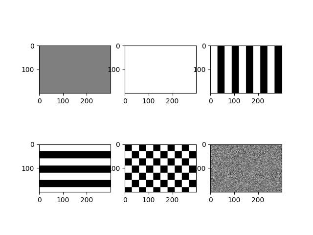

# Instruções

- Siga fielmente a entrada e a saída solicitadas.

# Tarefa 1

- q01.py: dado um inteiro **n**, gere uma sequência de inteiros seguindo a seguinte regra: se **n** for par, divida-o por 2 e se for ímpar, multiplique-o por 3 e some 1. Adicione os números dessa sequência na lista seq. Por exemplo, caso o inteiro passado como argumento for 22, será escrita na tela a lista: [22, 11, 34, 17, 52, 26, 13, 40, 20, 10, 5, 16, 8, 4, 2, 1].
	- **entrada:** um inteiro **n** como argumnto da linha de comando (use sys.argv)
	- **saída:** a sequência de números gerados escrita na tela
- q02.py: o programa deve escrever em um arquivo "tabuada.txt" a tabuada de 1 a 9 (nessa ordem), no seguinte formato para a tabuada de a: a x b = a*b (exemplo: 3 x 5 = 15). Veja o arquivo tabuadaGabarito.txt para ver a formatação completa.
	- **entrada:** nenhuma
	- **saída:** a tabuada escrita no arquivo tabuada.txt
- q03.py: defina uma função chamada fatorial que retorne o fatorial de um inteiro passado como parâmetro e outra função chamada coefBinomial com dois parâmetros **a** e **b** e retorne o coeficiente binomial **a** sobre **b**. O programa deve receber dois inteiros **n** e **k** como argumento da linha de comando (use sys.argv) e escrever na tela o resultado do coeficiente binomial **n** sobre **k** (se $k \ge n$, o programa nada deve escrever).
	- **entrada:** um inteiro **n** e um inteiro **k** como argumnto da linha de comando (use sys.argv)
	- **saída:** o coeficiente binomial **n** sobre **k** caso $k \lt n$
- q04.py: dados três inteiros **h, w, x**, escreva uma matriz $h \times w$ (h linhas e w colunas) repleta de x. Por exemplo, se $h = 2, w = 3, x = 7$, será escrita a matriz [[7. 7. 7.] [7. 7. 7.]].
	- **entrada:** três inteiros **h, w, x** como argumentos da linha de comando (use sys.argv)
	- **saída:** uma matriz do numpy com **h** linhas, **w** colunas e cujos elementos são iguais a x
- q05.py: dados dois inteiros **h** e **w**, o programa deve escrever na tela uma matriz $h \times w$ tal que $a_{ij} = j$. Por exemplo, se $h = 3 e w = 4$, será escrita a matriz [[0, 1, 2, 3], [0, 1, 2, 3], [0, 1, 2, 3]].
	- **entrada:** dois inteiros **h, w** como argumentos da linha de comando (use sys.argv)
	- **saída:** uma matriz do numpy com **h** linhas, **w** colunas e cujos elementos são tais que $a_{ij} = j$
- q06.py: dados dois inteiros **h** e **w**, o programa deve plotar na tela a imagem de um gradiente horizontal de tamanho $w \times h$ (w de largura, h de altura) em tons de cinza tal que $a_{ij} = j$.
	- **entrada:** dois inteiros **h, w** como argumentos da linha de comando (use sys.argv)
	- **saída:** plot com a imagem de uma matriz $h \times w$ tal que $a_{ij} = j$
- q07.py: o programa deve gravar em um arquivo 'q07.jpg' o plot das seguintes 6 imagens (em 2 linhas e 3 colunas) de tamanho $280 \times 200$ (280 colunas, 200 linhas):
	- imagem repleta de cinza (intensidade 127)
	- imagem repleta de branco (intensidade 255)
	- listras verticais com largura 30
	- listras horizontais com altura 30
	- padrão xadrez com casas de lado 30
	- imagem com intensidades aleatórias entre 0 e 255 (utilize np.random.randint)
	
	

	- **entrada:** nenhuma
	- **saída:** plot conforme imagem acima
- q08.py: o programa deve exibir na tela as 4 imagens de patch01.jpg a patch04.jpg em subplots
	- utilize cv2.cvtColor para transformar de BGR (ordem dos componentes de cor que o opencv utiliza) para RGB (ordem usual e que o matplotlib utiliza)
	- **entrada:** nenhuma
	- **saída:** plot com as 4 imagens
- q09.py: o programa deve exibir em um plot duas imagens: (1) patch01.jpg e (2) o filtro de canny aplicado na primeira imagem (pesquise como utilizar cv2.canny), usando 100 e 200 como limiares nos argumentos.
	- **entrada:** nenhuma
	- **saída:** plot com a imagem patch01.jpg e uma segunda imagem com o resultado obtido pelo filtro Canny
